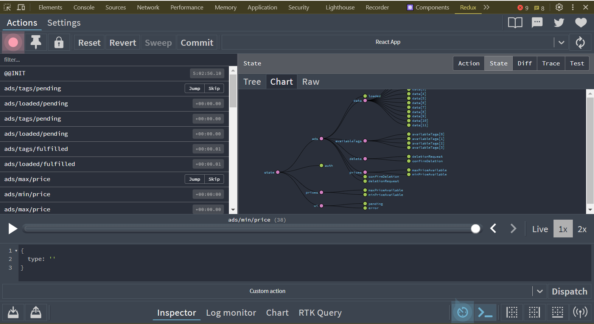
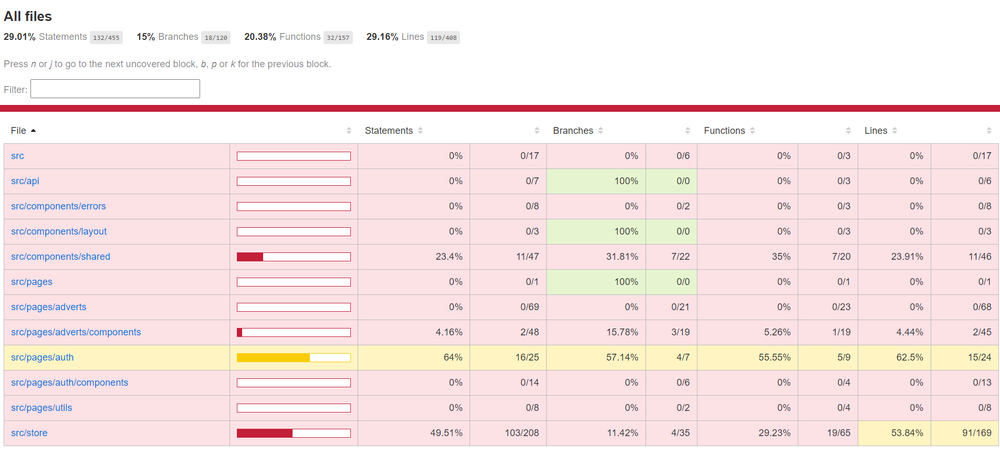
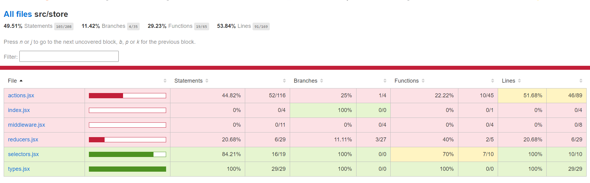
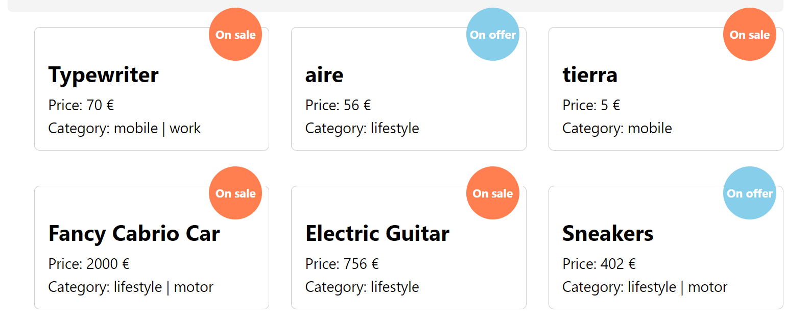
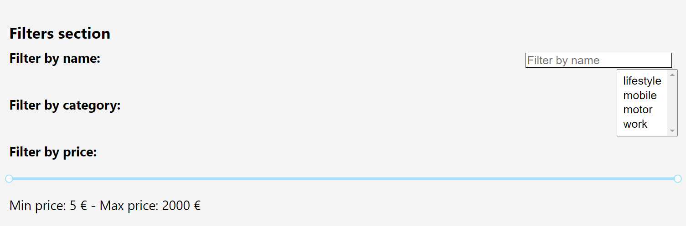
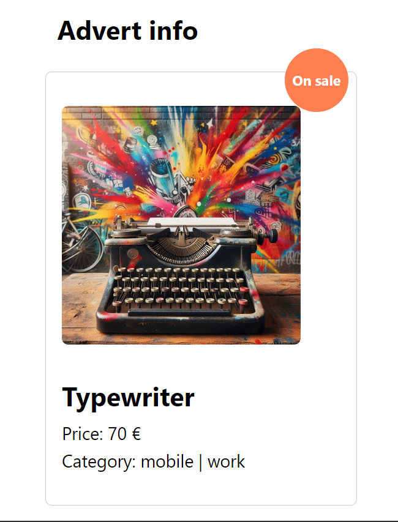
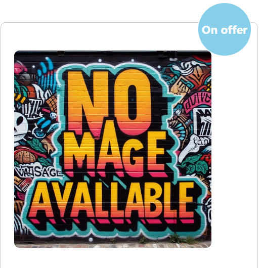
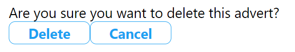
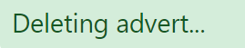
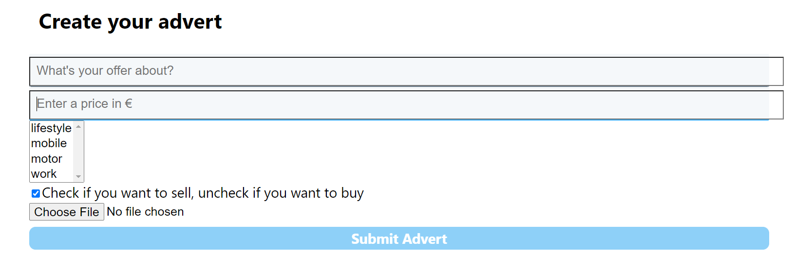

# Second hand store using React

This is a SPA project for the "React advanced" module, as part of the bootcamp "Web Development XVI Edition", by KeepCoding.

The task consists in building an application to display ads for items on sale/search.

## What's new in this version?

### Redux Store

Tis information is stored and accesible in a redux store:

- Login status
- Available ads
- Ad's detail
- Available tags
- Ads creation
- Ads deletion
- Max/Min price calculation

Please find the related files under the folder "store", so you can understand how types, actions, reducers, selectors and the store itself work.

### Redux Dev Tools

The Redux Store is configured with Redux Dev Tools, to make easier the debugging of the app.

<p>

</p>

### Unit Tests

Part of the app is now tested with Jest. There are 5 tests suites available so far, with a total of 17 tests developed and 2 component's snapshots taken.

Please install the latest version of Jest in your dependencies. Specially:

**@testing-library/user-event**: v13.3.0

**UserEffect** method is currently **asynchronous**, and that's how the related tests are managed regarding this feature.

Run:

```sh
npm run test
```

**There are unit tests for:**

- Synchronous actions
- Asynchronous actions
- Reducers
- Selectors
- Components:
  - Snapshots
  - Mocked interaction

Please navigate to the following folders to check the tests:

- `src/pages/adverts/store/__tests__`:
  - actions.test.jsx
  - reducers.test.jsx
  - selectors.test.js
- `src/pages/adverts/auth/components/__tests__`:
  - LoginPage.test.jsx
  - `__snapshots__ `
    - LoginPage.test.jsx.snap
- `src/pages/adverts/components/__tests__`:
  - Advert.test.jsx
  - `__snapshots__`
    - Advert.test.jsx.snap

#### Tests Coverage All

<p>

</p>

#### Tests Coverage All src/store

<p>

</p>

## Backend: Nodepop API

Our React store uses [Nodepop API](https://github.com/davidjj76/nodepop-api) as a backend. Please, find instructions on how to put it live [here](https://github.com/davidjj76/nodepop-api).

IMPORTANT: set a .env with this variable:

```js
REACT_APP_API_BASE_URL = http://localhost:3001/
```

## Create React App

The app is built using Create React App. To run it, please use:

Run it in the developement mode:

```sh
npm start
```

Run it in the production mode:

```sh
npm build
```

## Routes

### Public routes

#### /Login

Served by the component LoginPage, it is the unique public route in the project. No authorization is needed to navigate to this URL. It renders the login form.

#### Authorization token

If you wan't to store your authentication token, click the checkbox in the login form:

<p>

</p>

### Protected routes

You need to login in order to see these routes.

#### /adverts

<p>

</p>
Served by the component AdvertsPage. If any, it shows a list of the adverts available at that time. In this screen, the adverts show:

- Name
- Type of offer: on sale / on search
- Price in €
- Category (tags)

If there are no adverts to show, user will get a call to action with a button to create an advert.

##### Filters zone

There is a place reserved for filters in this screen:

<p>

</p>
- By name: filters by the name of the ad.
- By category: filters by the tags of the ad. To get a match, the advert needs to have the same tags marked in the select input.
- By price range: use the slider to set a minimum and maximum range of prices to retrieve the adverts you want.

Use "reset filters" button to delete the filters when you don't need them anymore.

By clicking in one of the adverts you will navigate to the advert's detail screen.

#### /adverts/:id

Here you can see the detail of the advert you want. It is managed by the component AdvertPage.

<p>

</p>
The advert detail shows:

- Name
- Price in €
- Category (tags)
- Type of offer: on sale / looking for
- Photo: 300px x 300px

If the advert doesn't have any photo, it will show a default backup image:

<p>

</p>
##### Delete advert

The detail of the advert includes a setup to delete the advert. A confirmation flow is shown before deleting the ad.

<p>

</p>

Confirmation:

<p>

</p>

Deletion:

<p>

</p>

#### /adverts/new

This one is served by the component NewAdvertPage. It is a form to submit new adverts.

<p>

</p>

All inputs are required except "photo". The sbmit button will stay disabled until the form is fulfilled.

## Secondary components

The components detailed above are using smaller components to manage their functionalities.

### NewAdvertForm

It is one of the biggest component in the setup and the core of NewAdvertPage.

### Advert

It is the core component for AdvertPage.

### AdvertPage

It is the core component for AdvertsPage.

## Basic components

These are smaller components shared by the biggest ones:

- Button
- CheckBox
- FileInput
- FilterCase
- FormField
- Photo
- SelectMenu
- SliderRange

## Communication flow

Error / success is represented by:

- Disabling /enabling buttons
- Error messages in red
- Success messages in green
